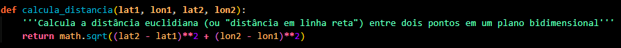
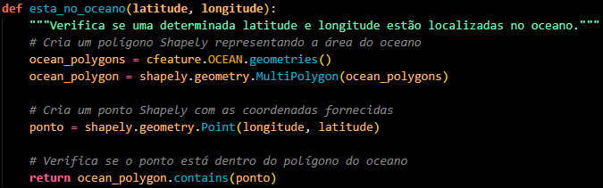
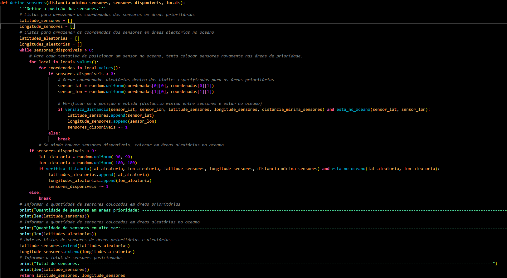
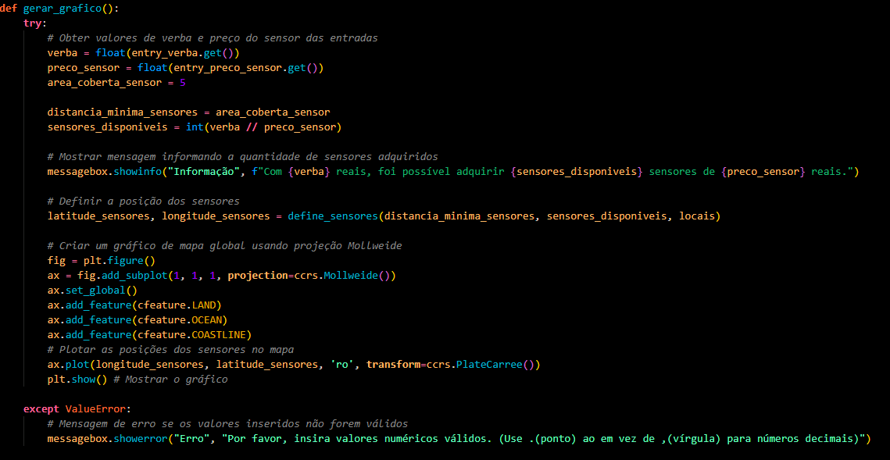
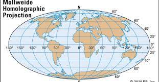
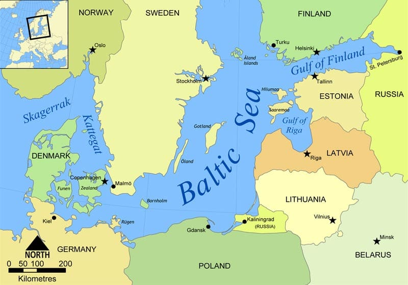
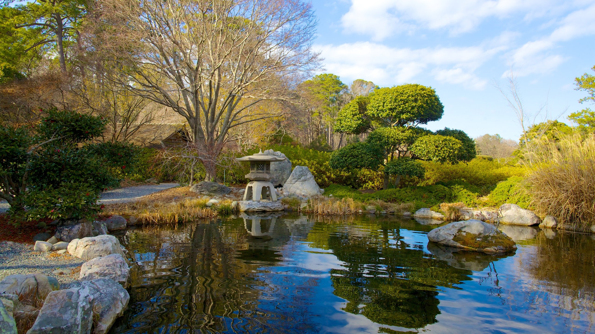

#### Pedro Henrique Pedrosa Tavares RM97877
#### Guilherme Rocha Bianchini RM97974
#### Vinicius do Carmo Fonseca Freitas RM97599

## Distribuição de Sensores de Poluição Oceânicos

Este código Python implementa um sistema para simular a configuração de sensores oceânicos, considerando restrições de orçamento, áreas de prioridade e o alcance de cada sensor (calcula distância mínima entre os sensores para evitar desperdicio). O código utiliza bibliotecas como cartopy, matplotlib, shapely, e tkinter para criar um mapa interativo e gerar visualizações dos sensores posicionados.

**Objetivo:**

O objetivo deste código é demonstrar como sensores de poluição podem ser distribuídos em áreas oceânicas, priorizando áreas de maior relevância ambiental e garantindo uma cobertura eficiente. 

**Funcionalidades:**

* **Definição de Áreas Prioritárias:** O código define áreas prioritárias para a colocação de sensores, divididas em duas categorias:
    * **Prioridade 1:** Áreas de grande importância ambiental, como recifes de coral, deltas de rios e afloramentos costeiros.
    * **Prioridade 2:** Áreas com relevância ambiental, mas com menor prioridade que a categoria 1.
    * **Prioridade 3:** Áreas de alto mar: Ainda em grande parte inexploradas, mas ameaçadas por atividades prejudiciais.
* **Cálculo da Distância entre Sensores:** O código calcula a distância entre sensores para garantir que eles estejam espaçados de forma eficiente, evitando desperdício de recursos.
* **Verificação da Localização no Oceano:** O código verifica se a localização gerada para um sensor está dentro do oceano, garantindo que ele seja colocado em uma área válida.
* **Distribuição de Sensores:** O código distribui os sensores de forma aleatória, priorizando as áreas de maior relevância e garantindo que a distância mínima entre eles seja respeitada.
* **Visualização Gráfica:** O código gera um mapa com a distribuição dos sensores, permitindo a visualização da cobertura e da localização dos sensores.

**Utilização:**

1. **Instalação das Bibliotecas:**
    ```bash
    pip install cartopy matplotlib shapely tkinter
    ```
2. **Execução do Código:**
    * Execute o código Python.
    * Uma janela gráfica será aberta, solicitando a verba disponível e o preço do sensor.
    * Insira os valores desejados e pressione o botão "Gerar Mapeamento".
    * Um mapa será exibido com a distribuição dos sensores.

**Parâmetros:**

* **Verba disponível:** Valor total disponível para a compra de sensores.
* **Preço do sensor:** Valor individual de cada sensor.
* **Área coberta pelo sensor:** Área de alcance do sensor. (Por padrão, está definida como 5 graus)
* **Distância mínima entre sensores:** Distância mínima permitida entre sensores para garantir uma cobertura eficiente.

**Exemplo de uso:**

```
Verba disponível: 100000
Preço do sensor: 5000
```

Neste caso, o código irá distribuir 20 sensores (100000 / 5000 = 20) de forma eficiente, priorizando as áreas de maior relevância ambiental.

**Exemplos em imagem:**


## Funções do Código:

**1. `calcula_distancia(lat1, lon1, lat2, lon2)`:**

    - Esta função calcula a distância euclidiana (distância em linha reta) entre dois pontos geográficos, especificados pelas suas latitudes e longitudes. A fórmula utilizada é a fórmula da distância euclidiana bidimensional:
    - A fórmula utilizada é a fórmula da distância euclidiana bidimensional: `math.sqrt((lat2 - lat1)**2 + (lon2 - lon1)**2)`.
    - A função recebe as coordenadas de dois pontos (latitude e longitude) como entrada e retorna a distância entre eles.

#### Observação:

Embora a Fórmula de Haversine seja mais precisa para calcular distâncias entre pontos geográficos na superfície da Terra, ela é mais complexa e computacionalmente mais intensiva. A Fórmula de Haversine leva em consideração a curvatura da Terra e é recomendada para distâncias maiores ou aplicações onde a precisão é crucial.

Neste projeto, optamos por utilizar a fórmula da distância euclidiana bidimensional para simplificar o cálculo e reduzir a complexidade do código. Esta abordagem é suficiente para a ilustração do nosso projeto.





**2. `verifica_distancia(lat1, lon1, lat2, lon2, distancia_minima_sensores)`:**

    - Esta função verifica se um novo sensor pode ser posicionado em uma determinada coordenada (lat1, lon1), considerando a distância mínima entre sensores. 
    - A função recebe a coordenada do novo sensor, uma lista de coordenadas de sensores já posicionados e a distância mínima permitida entre sensores.
    - Ela itera sobre a lista de coordenadas de sensores existentes e calcula a distância do novo sensor a cada um deles.
    - Se a distância for menor que a distância mínima, a função retorna `False`, indicando que o novo sensor não pode ser posicionado. Caso contrário, a função retorna `True`.
    - A função utiliza a função `calcula_distancia()` para calcular a distância entre os pontos.


**3. `esta_no_oceano(latitude, longitude)`:**

    - Esta função determina se um ponto geográfico dado está localizado dentro da área do oceano. 
    - Ela usa a biblioteca `cartopy` para obter os polígonos que representam a área do oceano.
    - O ponto geográfico é transformado em um objeto `shapely.geometry.Point` e o oceano em um `shapely.geometry.MultiPolygon`.
    - A função `ocean_polygon.contains(ponto)` verifica se o ponto está dentro do polígono do oceano e retorna `True` se estiver, caso contrário, `False`.


**4. `define_sensores(distancia_minima_sensores, sensores_disponiveis, locais)`:**

    - Esta função é a parte central do algoritmo, responsável por posicionar os sensores no mapa, considerando as restrições de orçamento, áreas de prioridade e distância mínima.
    - A função recebe a distância mínima permitida entre sensores, o número de sensores disponíveis e um dicionário `locais` que define as áreas de prioridade com seus limites geográficos.
    - A função utiliza dois loops aninhados:
        - **Loop externo**: itera sobre as áreas de prioridade.
        - **Loop interno**: itera sobre as coordenadas de cada área de prioridade.
    - Para cada coordenada dentro de uma área de prioridade, a função tenta posicionar um sensor, verificando se a posição está dentro dos limites da área, se está no oceano e se a distância mínima entre sensores é respeitada.
    - Se um sensor for posicionado, a função remove um sensor da contagem de sensores disponíveis e adiciona as coordenadas do sensor a uma lista.
    - Se todos os sensores forem posicionados em áreas de prioridade, a função tenta posicionar os sensores restantes em áreas aleatórias no oceano, utilizando o mesmo processo de verificação de distância e localização.
    - A função retorna duas listas: uma lista com as latitudes e outra com as longitudes dos sensores posicionados.


**5. `gerar_grafico()`:**

    - Esta função é responsável por gerar a interface gráfica e o mapa.
    - Ela recebe a verba disponível, o preço do sensor e a área coberta por cada sensor como entrada.
    - A função calcula a quantidade de sensores que podem ser adquiridos com a verba disponível.
    - Em seguida, a função chama a função `define_sensores()` para posicionar os sensores.
    - A função cria uma figura usando `matplotlib.pyplot` e define a projeção do mapa como `ccrs.Mollweide()`, um tipo de projeção cartográfica que representa o globo terrestre como um elipsoide.
    - A função utiliza `cfeature` para adicionar recursos visuais ao mapa, como linhas de costa, oceanos e terras.
    - A função plota os sensores posicionados como pontos vermelhos no mapa usando `ax.plot(longitude_sensores, latitude_sensores, 'ro', transform=ccrs.PlateCarree())`.
    - A função `plt.show()` exibe o mapa.


**6. `root = tk.Tk()` e `root.mainloop()`:**

    - Estas linhas de código criam a janela principal da interface gráfica e iniciam o loop principal da interface gráfica, respectivamente.
    - O código utiliza a biblioteca `tkinter` para criar uma interface gráfica simples com entradas para o usuário fornecer a verba disponível e o preço do sensor.
    - O botão "Gerar Mapeamento" chama a função `gerar_grafico()`, que gera o mapa e o exibe.


**Observações:**

    - O código assume que a área coberta por cada sensor é de 5 unidades de distância (distância euclidiana).
    - A função `define_sensores()` prioriza a colocação de sensores nas áreas de prioridade definidas.
    - A função `gerar_grafico()` exibe um mapa interativo com os sensores posicionados, permitindo ao usuário visualizar a configuração dos sensores.
    - O código usa a projeção `Mollweide` para representar o mapa global, pois é uma projeção que preserva as áreas, o que é importante para representar corretamente a distribuição dos sensores.


**Conclusão:**

Este código demonstra um exemplo simples de um sistema de simulação de configuração de sensores oceânicos, considerando restrições de orçamento, áreas de prioridade e distância mínima entre sensores. O código pode ser adaptado para incluir mais recursos, como simular o movimento dos sensores, incorporar dados ambientais (temperatura, salinidade, etc.) ou criar interfaces gráficas mais complexas.


## Projeção Cartográfica Utilizada: Mollweide



O código utiliza a projeção cartográfica **Mollweide** para representar o mapa global. A projeção Mollweide é uma projeção pseudo-cilíndrica que preserva as áreas. Isso significa que áreas de mesma dimensão no globo terrestre são representadas com a mesma dimensão no mapa, evitando distorções significativas em relação à área real. 

**Por que usar a projeção Mollweide?**

Para o contexto de posicionamento de sensores oceânicos, a projeção Mollweide é uma escolha adequada por diversos motivos:

* **Preservação de áreas:** Como mencionado anteriormente, a projeção Mollweide preserva as áreas, o que é crucial para visualizar a distribuição espacial dos sensores no mapa. A distorção de áreas pode levar a interpretações errôneas da densidade de sensores e da cobertura do mapa.
* **Representação precisa de áreas oceânicas:** As áreas oceânicas são representadas com precisão, o que é importante para o posicionamento dos sensores e para a visualização da sua cobertura.
* **Boa visualização de áreas de alta latitude:** A projeção Mollweide é uma das projeções que representam as regiões polares com menos distorção, o que é importante para o posicionamento de sensores em regiões como o Ártico e a Antártida.
* **Facilidade de interpretação:** A projeção Mollweide tem um formato relativamente simples e intuitivo, facilitando a interpretação do mapa e a visualização da localização dos sensores.

**Outras projeções cartográficas:**

Existem outras projeções cartográficas que podem ser usadas para representar o globo terrestre, cada uma com suas características e vantagens específicas. No entanto, a projeção Mollweide se destaca pela sua capacidade de preservar as áreas, o que a torna uma boa escolha para o contexto de posicionamento de sensores oceânicos. 

**Considerações:**

É importante lembrar que todas as projeções cartográficas causam alguma distorção na representação do globo terrestre. A escolha da projeção ideal depende da aplicação específica e do tipo de distorção que se deseja minimizar. Neste caso, a preservação de áreas é prioritária, o que justifica o uso da projeção Mollweide.


## Critérios para a definição de Áreas Prioritárias:

A poluição aquática é uma ameaça generalizada e exige atenção em todos os locais do oceano. No entanto, alguns pontos merecem atenção especial devido à sua sensibilidade e importância ecológica:


### Locais Específicos do Oceano que Exigem Maior Atenção:

Aqui estão alguns locais específicos do oceano que exigem atenção especial devido à poluição aquática, com referências de artigos e livros para comprovar as afirmações:

**Grande Barreira de Coral, Austrália:**

* **Sensibilidade:** Este recife, o maior do mundo, é extremamente sensível à poluição por nutrientes, sedimentos e produtos químicos.
* **Importância:** Abriga uma biodiversidade incrível, fornece proteção costeira e sustenta pescarias.
* **Ameaças:** A poluição por esgoto, agricultura e turismo causa o branqueamento de corais, doenças e a perda de habitat.
* **Referências:**
    * **Artigo:** "Climate change and the Great Barrier Reef" (Great Barrier Reef Foundation).
    * **Livro:** "The Great Barrier Reef: History, Science, Heritage" (by James Bowen (Author), Margarita Bowen (Author))


É o maior recife de coral do mundo, abrigando uma biodiversidade excepcional e desempenhando um papel crucial na proteção costeira e na economia australiana. A ameaça do branqueamento de corais, causada pelo aquecimento global e pela poluição, coloca em risco a sobrevivência do recife e de toda a sua rica fauna e flora.

**Golfo do México:**

* **Sensibilidade:** Este golfo é altamente suscetível à poluição por petróleo, esgoto e produtos químicos.
* **Importância:** É um importante berçário para muitas espécies marinhas e sustenta uma indústria pesqueira significativa.
* **Ameaças:** O derramamento de petróleo, a poluição por esgoto e a agricultura industrial causam a morte de animais marinhos, a contaminação da cadeia alimentar e a perda de habitat.
* **Referências:**
    * **Artigo:** "Environmental effects of the Deepwater Horizon oil spill" (National Institute of Health).


O derramamento de petróleo, a poluição por esgoto e a agricultura industrial causam impactos devastadores na vida marinha, na pesca e na economia da região. A recuperação do ecossistema é lenta e exige ações urgentes para evitar novos desastres.

**Mar Báltico:**

* **Sensibilidade:** Este mar semi-fechado é altamente suscetível à poluição por nutrientes, esgoto e produtos químicos.
* **Importância:** Abriga uma biodiversidade única e sustenta uma indústria pesqueira importante.
* **Ameaças:** A poluição por esgoto, agricultura e indústria causa a proliferação de algas, a redução da qualidade da água e a perda de habitat.
* **Referências:**
    * **Artigo:** "A Case Study of Baltic Sea Environmental Governance" (Mikael Karlsson , Michael Gilek , and Cecilia Lundberg).



A poluição por nutrientes, esgoto e produtos químicos causa a proliferação de algas, a redução da qualidade da água e a perda de habitat, impactando a pesca e a saúde humana. A localização semi-fechada do mar torna a recuperação mais lenta e exige ações coordenadas entre os países da região.

**Mar Mediterrâneo:**

* **Sensibilidade:** Este mar é altamente suscetível à poluição por esgoto, plástico e turismo.
* **Importância:** Abriga uma biodiversidade rica e é um importante destino turístico.
* **Ameaças:** A poluição por esgoto, plástico e turismo causa a morte de animais marinhos, a contaminação da cadeia alimentar e a perda de habitat.
* **Referências:**
    * **Artigo:** "Plastics in the Mediterranean" (IUCN).


A poluição por esgoto, agricultura e indústria causa a morte de animais marinhos, a contaminação da cadeia alimentar e a perda de habitat, impactando a saúde humana e a segurança alimentar de milhões de pessoas. A necessidade de ações urgentes para reduzir a poluição e proteger os recursos hídricos é crucial.

**Delta do Rio Ganges, Índia:**

* **Sensibilidade:** Esta área é altamente suscetível à poluição por esgoto, agricultura e indústria.
* **Importância:** É uma importante área de desova para muitas espécies marinhas e sustenta uma população humana significativa.
* **Ameaças:** A poluição por esgoto, agricultura e indústria causa a morte de animais marinhos, a contaminação da cadeia alimentar e a perda de habitat.
* **Referências:**
    * **Artigo:** "The world’s most sacred river—the Ganges—is also one of its dirtiest" (The Economist).


A poluição por esgoto, plástico e turismo causa a morte de animais marinhos, a contaminação da cadeia alimentar e a perda de habitat, impactando a biodiversidade e o turismo. A necessidade de ações coordenadas para reduzir a poluição e proteger o ecossistema marinho é fundamental.

**Triângulo dos Corais:**

* **Sensibilidade:** Abriga a maior biodiversidade de recifes de coral do mundo, extremamente sensível à poluição por nutrientes, sedimentos e produtos químicos. 
* **Importância:** Sustenta a pesca, o turismo e a segurança alimentar de milhões de pessoas. 
* **Ameaças:** Desmatamento, agricultura, pesca excessiva, desenvolvimento costeiro e mudanças climáticas.
* **Referências:**
    * **Artigo:** "The Coral Triangle: The Centre of Marine Biodiversity" (The Marine Diaries).


**Arquipélago de Galápagos:**

* **Sensibilidade:** Patrimônio Mundial da UNESCO, abriga espécies únicas e endêmicas, altamente sensíveis à introdução de espécies invasoras e à poluição.
* **Importância:** Centro de pesquisa científica e turismo ecológico, crucial para a conservação da biodiversidade.
* **Ameaças:** Turismo descontrolado, pesca ilegal, introdução de espécies invasoras, poluição por plástico e mudanças climáticas.
* **Referências:**
    * **Artigo:** "The Galápagos Islands: A Natural Laboratory?" (Environment & Society Portal).
    * **Livro:** "Galapagos: A Natural History" (by Michael H. Jackson).


**Afloramento da Costa Oeste da África:**

* **Sensibilidade:** Região de alta produtividade biológica, sustenta importantes pescarias e abriga uma rica biodiversidade.
* **Importância:** Essencial para a segurança alimentar e a economia de países da África Ocidental.
* **Ameaças:** Pesca excessiva, poluição por petróleo, mudanças climáticas e acidificação dos oceanos.
* **Referências:**
    * **Artigo:** "Benguela Current Marine Ecosystem Sites" (UNESCO).

**Afloramento da Califórnia:**

* **Sensibilidade:** Região de alta produtividade biológica, sustenta importantes pescarias e abriga uma rica biodiversidade.
* **Importância:** Essencial para a economia da Califórnia e para a segurança alimentar dos Estados Unidos.
* **Ameaças:** Pesca excessiva, poluição por esgoto e produtos químicos, mudanças climáticas e acidificação dos oceanos.
* **Referências:**
    * **Artigo:** "Oceanography of the Northern California Current Study Area" (NOAA).

**Mar do Peru:**

* **Sensibilidade:** Região de alta produtividade biológica, sustenta importantes pescarias e abriga uma rica biodiversidade.
* **Importância:** Essencial para a economia do Peru e para a segurança alimentar da América do Sul.
* **Ameaças:** Pesca excessiva, poluição por esgoto e produtos químicos, mudanças climáticas e acidificação dos oceanos.
* **Referências:**
    * **Artigo:** "The Humboldt Current System: Ecosystem components and processes, fisheries, and sediment studies" (ScienseDirect).


**Everglades da Flórida:**

* **Sensibilidade:**  Ecossistema de manguezais e pântanos, crucial para a filtração de água e a proteção costeira.
* **Importância:** Abriga uma rica biodiversidade e é um importante destino turístico.
* **Ameaças:** Poluição por esgoto e produtos químicos, perda de habitat, desenvolvimento urbano e mudanças climáticas.
* **Referências:**
    * **Artigo:** " Independent Scientific Review of Everglades Restoration Progress" (National Academies).
    * **Livro:** "The Everglades: River of Grass" (by Marjory Stoneman Douglas (Author), Michael Grunwald (Afterword)).


**Sundarbans:**

* **Sensibilidade:** Maior manguezal do mundo, abriga o tigre de Bengala e outras espécies ameaçadas de extinção.
* **Importância:** Protege as costas da erosão, regula o clima e sustenta a pesca.
* **Ameaças:** Desmatamento, poluição por esgoto e produtos químicos, pesca excessiva e mudanças climáticas.
* **Referências:**
    * **Artigo:** "Protecting The Precious Sundarbans: A Comprehensive Review of Biodiversity, Threats and Conservation Strategies In The Mangrove Ecosystem" (by Aloke Saha, Chandan Sarkar).
    * **Artigo:** "The Sundarbans" (UNESCO).


**Baía de Chesapeake:**

* **Sensibilidade:** Estuário importante para a pesca e o turismo, altamente suscetível à poluição por nutrientes e sedimentos.
* **Importância:** Abriga uma rica biodiversidade e é um importante centro econômico.
* **Ameaças:** Poluição por esgoto e produtos químicos, desenvolvimento urbano, agricultura intensiva e mudanças climáticas.
* **Referências:**
    * **Artigo:** "Our History - Chesapeake Bay Program" (chesapeakbay.net).
    * **Livro:** "A READING LIST OF BOOKS ABOUT THE CHESAPEAKE BAY WATERSHED" (ALLIANCE for the Chesapeake Bay).
    * **Artigo:** "Bay History" (Maryland Sea Grant).



**Ártico:**

* **Sensibilidade:** Região de grande importância ecológica, abriga uma rica biodiversidade e regula o clima global.
* **Importância:** Centro de pesquisa científica e fonte de recursos naturais.
* **Ameaças:** Mudanças climáticas, derretimento do gelo, poluição por petróleo e produtos químicos, pesca excessiva e desenvolvimento industrial.
* **Referências:**
    * **Artigo:** "Arctic climate change and its impacts on the ecology of the North Atlantic." (Charles Greene, A. J. Pershing, Thomas M Cronin)


**Antártida:**

* **Sensibilidade:** Continente gelado, abriga uma rica biodiversidade e regula o clima global.
* **Importância:** Centro de pesquisa científica e fonte de recursos naturais.
* **Ameaças:** Mudanças climáticas, derretimento do gelo, poluição por petróleo e produtos químicos, pesca excessiva e turismo descontrolado.
* **Referências:**
    * **Artigo:** "Antarctic Climate Change and the Environment: A Decadal Synopsis and Recommendations for Action" (SCAR).


## Links importantes:

* [GBIF](https://www.gbif.org/)
* [World Wildlife Fund](https://www.worldwildlife.org/)
* [IUCN](https://www.iucn.org/)
* [National Centers for Environmental Information (NCEI)](https://www.ncei.noaa.gov/)
* [Copernicus Marine Service](https://marine.copernicus.eu/register-copernicus-marine-service?mtm_campaign=Copernicus-Souscription&mtm_medium=cpc&mtm_source=google&mtm_content=text&mtm_cid=145762311002&mtm_kwd=copernicus%20marine%20service&gad_source=1&gclid=Cj0KCQjwpNuyBhCuARIsANJqL9NhVo-NiWvpfet0a9j6Q6nEQ7bzAU4-akwsbFHR0MIyA8paHt05NpkaAqrJEALw_wcB) 
* [NOAA Tides and Currents](https://tidesandcurrents.noaa.gov/map/)
* [Ocean Biodiversity Information System (OBIS)](https://obis.org/)
* [NOAA](https://www.noaa.gov/)
* [Ocean Data View (ODV)](https://odv.awi.de/) 
